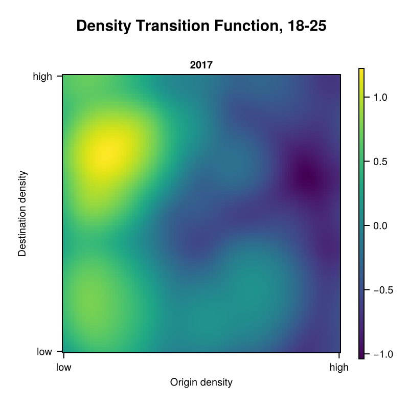
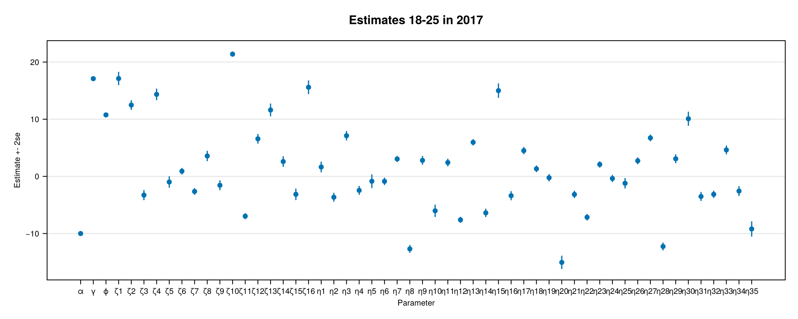

# MigFlow


## Getting Julia

If you're on Linux, run

```
$ curl -fsSL https://install.julialang.org | sh
```

For Windows and further advice please look
[here](https://github.com/JuliaLang/juliaup). This repository uses
Julia 1.15.5; to get it and make it the default, run


```
$ juliaup add 1.11.5
$ juliaup default 1.11.5
```

Whenever you type `'julia'` into a terminal now, it will start Julia
version 1.11.5.

## Getting all needed libraries
Once you have the correct Julia version, you can clone the repository
and install all needed Julia libraries.

```
$ git clone https://github.com/khoffie/MigFlow.git
$ cd MigFlow
$ julia --project=. -e 'using Pkg; Pkg.instantiate()'
```

This will install all libraries needed in the correct version.

## Basic usage
First extract the archive with the data. Mainly, the archive contains
flows of the age group 18-25 in 2017. Shapefiles and additional data
about districts is provided as well.

```
$ tar -xvf data/data.tar.gz -C data
```

### Load libraries, functions and data

```
using CSV, DataFrames, Turing, StatsBase, Random, Plots, StatsPlots, Distributions
using CategoricalArrays, NamedArrays, LaTeXStrings, Loess
using ADTypes, KernelDensity, Serialization, DynamicPPL, LinearAlgebra
using IterTools, Mooncake, Revise, GeoStats, GeoIO, CairoMakie
using StatsBase: coeftable
include("../src/estimation.jl")
include("../src/loadgermdata.jl")
includet("../src/analyze.jl")
includet("../src/analyzegeo.jl")
includet("../src/analyzedensity.jl")
includet("../src/analyzeresults.jl")
includet("../src/diagplots.jl")
include("../src/model.jl")
include("../src/model_helpers.jl")
include("../src/plotutils.jl")

shp = GeoIO.load("../data/clean/shapes/districts_ext.shp");
st = GeoIO.load("../data/clean/shapes/states.shp")

```

### Fit baseflow model

```
mdl = baseflow(
    load_data(
        "30-50", # age group
        2014, # year
        0.1, # Fraction of rows to use, e.g. 10%
        "../data/"; ## path where FlowDataGermans.csv and districts.csv
        ## are stored
        only_positive = true, # return only positive flows / drop zero
        # flows
        seed = 1234, # Random seed for reproducibility
        opf = false # depracated, ignore
    ),
    normalize = false, ## normalize desirabilities, ## currently only false supported
    ndc = 16, # number of radial basis centers for density transition function
    ngcx = 5 # number of radial basis centers for geographical
             # asymmetries in x direction. y direction is set
             # automatically
);

inits = initialize(mdl.data.age, mdl.mdl.args.ndc, mdl.mdl.args.ngcx, mdl.mdl.args.ngcy);
@time out = estimate(mdl, optim_kwargs = (; show_trace = false, inits = inits));

```

### Postprocess
```

## diagnostic plots
post = analyze(out)
## heatmap of density transition function
m, pdtf = plotdtf(out)
## Map of Germany showing locational asymmetries
geo, pgeo = plotgeo(out, shp, st)

savefig(post.plts[end], "../docs/check.pdf")
save("../docs/pdtf.pdf", pdtf)
save("../docs/pgeo.pdf", pgeo)

```

#### Check Model Fit

#### Density Transition Function

#### Locational Asymmetries

#### Estimates

