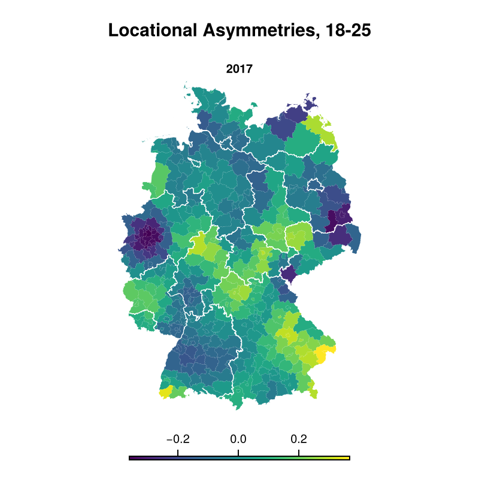

# MigFlow
This repository contains the code for the **baseflow model of internal migration**.  
We model internal migration flows of six age groups between German districts from 2000 to 2017.  
The model provides:

- an accurate estimation of the effect of distance (unbiased across all distances)
- an interpretable functional form grounded in scientific reasoning
- good predictions that can be aggregated to quantities such as net migration
- flexible yet regularized estimates of the effect of population density
- flexible yet regularized estimates of geographical asymmetries
  (i.e., factors influencing migration that are not related to
  density).

## Usage
### Getting Julia

If you're on Linux, run

```
$ curl -fsSL https://install.julialang.org | sh
```

For Windows and further advice please look
[here](https://github.com/JuliaLang/juliaup). This repository uses
Julia 1.15.5; to get it and make it the default, run

```
$ juliaup add 1.11.5
$ juliaup default 1.11.5
```

Whenever you now type `'julia'` into a terminal, it will start Julia
version 1.11.5.

## Getting all needed libraries
Once you have the correct Julia version, you can clone the repository
and install all needed Julia libraries.

```
$ git clone https://github.com/khoffie/MigFlow.git
$ cd MigFlow
$ julia --project=. -e 'using Pkg; Pkg.instantiate()'
```

This will install all libraries needed in the correct version.

### Fitting the model
First extract the archive with the data. Mainly, the archive contains
flows of the age group 18-25 in 2017. Shapefiles and additional data
about districts is provided as well.

```
$ tar -xvf data/data.tar.gz -C data
```

#### Load libraries, functions and data

```
using CSV, DataFrames, Turing, StatsBase, Random, Plots, StatsPlots, Distributions
using CategoricalArrays, NamedArrays, LaTeXStrings, Loess
using ADTypes, KernelDensity, Serialization, DynamicPPL, LinearAlgebra
using IterTools, Mooncake, Revise, GeoStats, GeoIO, CairoMakie
using StatsBase: coeftable

include("../src/estimation.jl")
include("../src/loadgermdata.jl")
include("../src/analyze.jl")
include("../src/georbf.jl")
include("../src/densityrbf.jl")
include("../src/results.jl")
include("../src/diagplots.jl")
include("../src/model.jl")
include("../src/modelutils.jl")
include("../src/plotutils.jl")
include("../src/utils.jl")
include("../src/coefplot.jl")

shp = GeoIO.load("../data/clean/shapes/districts_ext.shp");
st = GeoIO.load("../data/clean/shapes/states.shp")

```

#### Fit baseflow model

```
mdl = baseflow(
    load_data(
        "18-25", # age group
        2014, # year
        0.1, # Fraction of rows to use, e.g. 10%
        "../data/"; ## path where FlowDataGermans.csv and districts.csv
        ## are stored
        only_positive = true, # return only positive flows / drop zero
        # flows
        seed = 1234, # Random seed for reproducibility
        opf = false # depracated, ignore
    ),
    normalize = false, ## normalize desirabilities, ## currently only false supported
    ndc = 16, # number of radial basis centers for density transition function
    ngcx = 5 # number of radial basis centers for geographical
             # asymmetries in x direction. y direction is set
             # automatically
);

inits = initialize(mdl.data.age, mdl.mdl.args.ndc, mdl.mdl.args.ngcx, mdl.mdl.args.ngcy);
@time out = estimate(mdl, optim_kwargs = (; show_trace = false, inits = inits));

```

#### Postprocess
```

## diagnostic plots
post = analyze(out)
## heatmap of density transition function
m, pdtf = plotdtf(out)
## Map of Germany showing locational asymmetries
geo, pgeo = plotgeo(out, shp, st)
## plotting estimates with standard errors
pcoefs = coefplot(out)

```





## Issues

## Additional Data
This repository contains only a sample dataset (18–25, 2017) as well
as additional data about districts and shapefiles. If you would like
to analyze other age groups or years, please [open an
issue](../../issues) in this repository. We can provide you either
- the already cleaned and preprocessed data for all age groups and years, or
- the raw data

In total, six age groups are available:
- Below 18
- 18–25
- 25–30
- 30–50
- 50–65
- above 65

Data are available for the years 2000–2017 (with 2003 omitted due to
data issues).

If you wish to analyze the raw data you can execute `raw_to_clean.R`.
You will need `R` and the package that contains the code to clean the
data: [R-cleaning-package](https://github.com/khoffie/MigFlow-helpeR).
